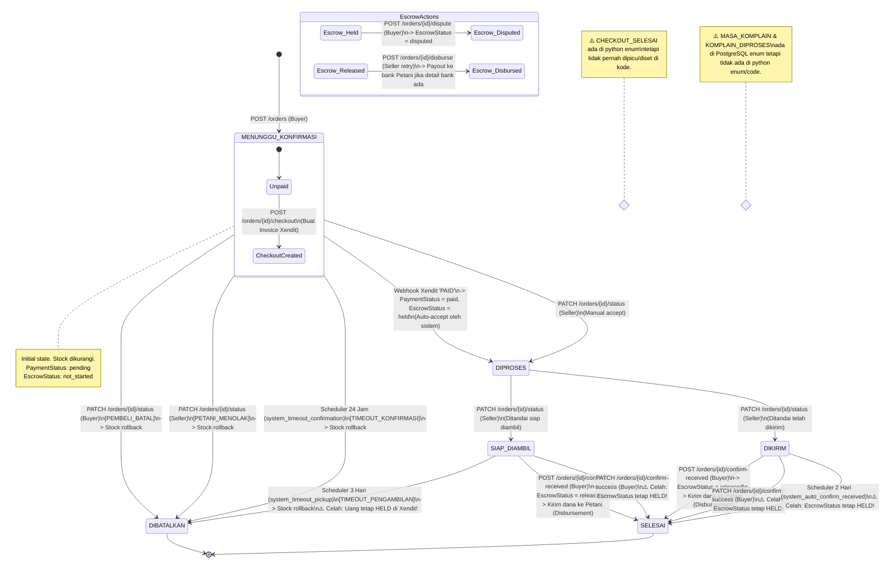
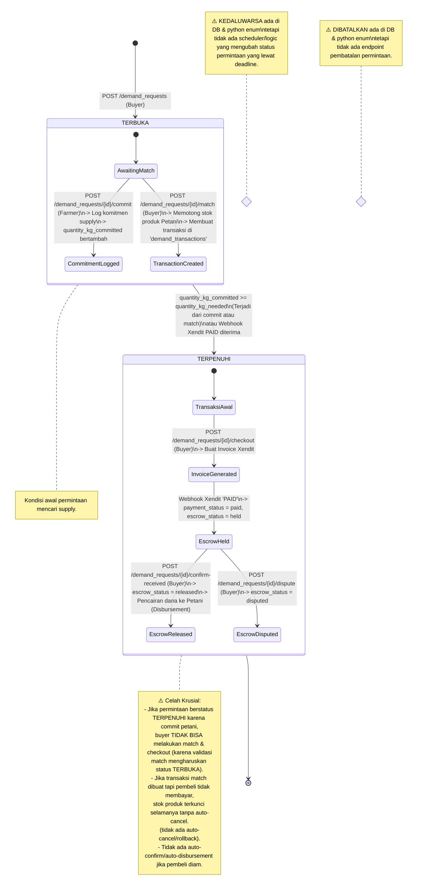

# Pemetaan Alur Transaksi & Analisis Celah Keamanan (Grove Project)

Dokumen ini memetakan seluruh alur transaksi di platform Grove, yang terbagi menjadi dua jenis transaksi utama: **Pembelian Biasa** (Product Purchase) dan **Ajukan Permintaan** (Demand Request). Pemetaan ini didasarkan pada eksplorasi menyeluruh terhadap kode backend FastAPI, migrasi database, model SQLAlchemy, service, dan webhook.

---

## 1. Analisis Model, Enum, & Migrasi Database

Berdasarkan riwayat migrasi (`backend/migrations/versions`) dan definisi model python (`backend/app/models`), berikut adalah status-status yang tercatat di sistem:

### A. Status Pesanan (`OrderStatus`)
Didefinisikan di [order.py](file:///d:/Documents/kuliah/veternityberaksi/grove/backend/app/models/order.py):
*   `CHECKOUT_SELESAI` (⚠️ **Status Yatim**: Ada di enum tapi tidak pernah diset oleh endpoint/logic mana pun).
*   `MENUNGGU_KONFIRMASI` (Status awal setelah pesanan dibuat).
*   `DIPROSES` (Petani menyetujui pesanan atau pembayaran escrow diverifikasi sukses).
*   `SIAP_DIAMBIL` (Barang siap diambil oleh pembeli).
*   `DIKIRIM` (Barang dikirim oleh petani ke pembeli).
*   `DITERIMA` (Status transisi sementara saat barang telah diterima).
*   `SELESAI` (Status akhir transaksi sukses setelah barang diterima).
*   `DIBATALKAN` (Status akhir kegagalan/pembatalan).

> [!WARNING]
> Di migrasi `af3756ce4f4a_upgrade_order_status_workflow.py`, status `MASA_KOMPLAIN` dan `KOMPLAIN_DIPROSES` telah didaftarkan ke tipe PostgreSQL `orderstatus`. Namun, kedua status ini **tidak ada** di enum Python `OrderStatus` dan tidak diimplementasikan sama sekali di logic backend.

### B. Status Permintaan (`DemandRequestStatus`)
Didefinisikan di [demand_request.py](file:///d:/Documents/kuliah/veternityberaksi/grove/backend/app/models/demand_request.py):
*   `TERBUKA` (Status awal saat permintaan dibuat).
*   `TERPENUHI` (Kuantitas komitmen petani mencapai kuantitas kebutuhan, atau pembayaran atas pencocokan permintaan/match telah lunas).
*   `KEDALUWARSA` (⚠️ **Status Yatim**: Ada di enum tetapi tidak ada scheduler atau logic yang memicu perubahan status ke kedaluwarsa saat deadline terlewati).
*   `DIBATALKAN` (⚠️ **Status Yatim**: Ada di enum tetapi tidak ada endpoint atau trigger pembatalan permintaan).

### C. Status Pembayaran (`PaymentStatus`) & Escrow (`EscrowStatus`)
Didefinisikan di [payment_transaction.py](file:///d:/Documents/kuliah/veternityberaksi/grove/backend/app/models/payment_transaction.py) dan digunakan baik oleh tabel `orders` maupun `demand_transactions`:
*   `PaymentStatus`:
    *   `pending` (Invoice Xendit aktif menunggu pembayaran).
    *   `paid` (Pembayaran diverifikasi sukses oleh Webhook Xendit).
    *   `expired` (⚠️ **Status Yatim**: Ada di enum tetapi tidak ditangani di webhook/scheduler).
    *   `failed` (⚠️ **Status Yatim**: Ada di enum tetapi tidak ditangani di webhook/scheduler).
*   `EscrowStatus`:
    *   `not_started` (Default sebelum pembayaran).
    *   `held` (Dana dari pembeli ditahan sementara di akun penampung/escrow).
    *   `released` (Dana telah dilepas dan ditransfer ke petani).
    *   `disputed` (Sedang dalam sengketa akibat komplain pembeli).
    *   `refunded` (⚠️ **Status Yatim**: Ada di enum tetapi tidak ada mekanisme pengembalian dana di kode).

---

## 2. Diagram State Transaksi

### Diagram 1: Alur Pembelian Biasa (Standard Product Purchase)
Alur dari pembuatan pesanan hingga status akhir (sukses/batal), beserta integrasi escrow payment dan scheduler otomatis.

---

### Diagram 2: Alur Ajukan Permintaan (Demand Request Flow)
Alur dari pembuatan permintaan oleh pembeli, pencocokan dengan produk milik petani, hingga siklus pembayaran escrow dan pencairan dana.

---

## 3. Tabel Ringkasan Status Transaksi

Tabel gabungan status transaksi dari alur Pembelian Biasa (P) dan Ajukan Permintaan (A):

| Status | Alur (P/A) | Trigger Masuk Ke Status Ini | Siapa yang Bisa Lihat / Mengakses | Status Selanjutnya yang Mungkin |
| :--- | :--- | :--- | :--- | :--- |
| **MENUNGGU_KONFIRMASI** | P | Pembeli mengirim data pembelian (`POST /orders`). | Pembeli & Petani (pemilik produk). | `DIPROSES`, `DIBATALKAN`. |
| **DIPROSES** | P | 1. Webhook Xendit `PAID` masuk (auto-accept). 2. Petani menyetujui secara manual (`PATCH /orders/{id}/status`). | Pembeli & Petani. | `SIAP_DIAMBIL`, `DIKIRIM`. |
| **SIAP_DIAMBIL** | P | Petani mengubah status ke `SIAP_DIAMBIL` (`PATCH /orders/{id}/status` -> `SIAP_DIAMBIL`). | Pembeli & Petani. | `DIBATALKAN` (jika timeout 3 hari), `DITERIMA` -> `SELESAI`. |
| **DIKIRIM** | P | Petani mengubah status ke `DIKIRIM` (`PATCH /orders/{id}/status` -> `DIKIRIM`). | Pembeli & Petani. | `DITERIMA` -> `SELESAI` (konfirmasi pembeli / auto-confirm 2 hari). |
| **DITERIMA** | P | Pembeli konfirmasi barang diterima atau pemicu scheduler (status ini transient). | Pembeli & Petani. | `SELESAI` (langsung dipicu otomatis). |
| **SELESAI** | P | Masuk otomatis setelah status `DITERIMA`. | Pembeli & Petani. | Tidak ada (status akhir). |
| **DIBATALKAN** | P | 1. Ditolak Petani / Dibatalkan Pembeli. 2. Timeout konfirmasi petani (24 jam) / Timeout pengambilan (3 hari). | Pembeli & Petani. | Tidak ada (status akhir). |
| **TERBUKA** | A | Pembeli membuat permintaan baru (`POST /demand_requests`). | Publik (siapa saja) & Pembeli pembuat. | `TERPENUHI`. |
| **TERPENUHI** | A | 1. Jumlah komitmen / pencocokan >= kuantitas dibutuhkan. 2. Webhook pembayaran match berhasil. | Publik & Pembeli pembuat. | Tidak ada (status akhir untuk model DemandRequest). |
| **CHECKOUT_SELESAI** | P | *(Tidak ada trigger)* ⚠️ **Status Yatim**. | - | - |
| **KEDALUWARSA** | A | *(Tidak ada trigger)* ⚠️ **Status Yatim**. | - | - |
| **DIBATALKAN** | A | *(Tidak ada trigger)* ⚠️ **Status Yatim**. | - | - |

---

## 4. Analisis Gap & Risiko Teknis (Critical Findings)

Berdasarkan pemeriksaan menyeluruh pada kode backend, ditemukan beberapa celah fatal yang dapat menyebabkan transaksi "nyangkut" atau kerugian dana/stok:

### 1. Kebuntuan Total pada Alur Komitmen Petani (`SupplyCommitment`)
*   **Masalah**: Petani berkomitmen melalui `POST /demand_requests/{id}/commit`. Kuantitas komitmen ditambahkan ke `quantity_kg_committed`. Jika total komitmen memenuhi kebutuhan, status permintaan berubah menjadi `TERPENUHI`.
*   **Gap/Bug**:
    *   Endpoint `/match` (satu-satunya cara membuat `DemandTransaction` untuk checkout pembayaran) memvalidasi `if req.quantity_kg_committed >= req.quantity_kg_needed: raise HTTPException(400, "Permintaan ini sudah terpenuhi")`.
    *   Endpoint `/candidates` juga menolak permintaan yang tidak berstatus `TERBUKA`.
    *   Komitmen petani *tidak* membuat record transaksi pembayaran apapun secara otomatis.
*   **Dampak**: Jika petani memanfaatkan tombol komitmen hingga kuantitas penuh, permintaan langsung terkunci sebagai `TERPENUHI`, namun **pembeli tidak akan pernah bisa melakukan pencocokan, checkout pembayaran, maupun membayar para petani tersebut**. Fitur komitmen ini menjadi jalan buntu (dead-end).

### 2. Auto-Cancel Pengambilan Barang (`Timeout Pickup`) Menahan Dana Tanpa Refund
*   **Masalah**: Ketika pesanan berada di status `SIAP_DIAMBIL` selama lebih dari 3 hari, scheduler memanggil `system_timeout_pickup` untuk mengubah status pesanan ke `DIBATALKAN` dan melakukan rollback stok barang.
*   **Gap/Bug**: Di titik ini, status pembayaran pembeli adalah `PAID` dan status escrow adalah `HELD`. Scheduler membatalkan pesanan, tetapi **tidak memicu pengembalian dana (refund) apa pun ke pembeli** (status escrow tetap `HELD`).
*   **Dampak**: Stok produk dikembalikan ke petani sehingga dapat dijual lagi, tetapi uang pembeli tertahan selamanya di escrow Xendit tanpa pengembalian dana otomatis.

### 3. Konfirmasi Otomatis Sistem (`Auto-Confirm Delivery`) Menahan Dana Petani
*   **Masalah**: Jika pesanan berstatus `DIKIRIM` dan pembeli tidak merespons selama 2 hari, scheduler memanggil `system_auto_confirm_received` untuk mengubah status ke `DITERIMA` lalu `SELESAI`.
*   **Gap/Bug**: Fungsi `system_auto_confirm_received` di `order_status_service.py` **tidak memanggil escrow service** untuk melepaskan dana (`confirm_received_and_release`).
*   **Dampak**: Pesanan dinyatakan `SELESAI` di sistem, tetapi status escrow tetap `HELD`. Petani tidak akan pernah menerima uang hasil penjualan secara otomatis meskipun pengiriman telah dikonfirmasi selesai oleh sistem.

### 4. Tidak Ada Pembatalan atau Rollback Stok Otomatis untuk Transaksi Permintaan (Demand Match)
*   **Masalah**: Saat pembeli melakukan pencocokan (`POST /demand_requests/{id}/match`), stok produk petani langsung dikurangi (atau habis terjual) dan record `DemandTransaction` berstatus `PENDING` dibuat.
*   **Gap/Bug**: Berbeda dengan Pembelian Biasa yang memiliki scheduler untuk membatalkan pesanan jika tidak dibayar, pada alur Permintaan **tidak ada scheduler atau mekanisme pembatalan otomatis untuk transaksi pencocokan yang tidak dibayar**.
*   **Dampak**: Jika pembeli melakukan match dengan produk petani tetapi tidak pernah melakukan checkout/pembayaran, stok produk petani tersebut akan terpotong selamanya, dan transaksi menggantung di status `PENDING` tanpa batas waktu.

### 5. Risiko Pembayaran Berhasil pada Pesanan yang Telah Kedaluwarsa/Batal (Race Condition)
*   **Masalah**: Scheduler pembatalan otomatis `check_confirmation_timeouts` membatalkan pesanan setelah 24 jam. Namun, batas waktu kedaluwarsa invoice Xendit yang dibuat mungkin belum lewat (atau berbeda tipis).
*   **Gap/Bug**: Jika pembeli membayar invoice sesaat setelah scheduler membatalkan pesanan, Webhook Xendit `/webhooks/xendit` akan memproses event `PAID`. Dalam `handle_payment_success`, status pembayaran diset menjadi `PAID` dan escrow diset menjadi `HELD`. Namun, karena status pesanan sudah `DIBATALKAN` (bukan `MENUNGGU_KONFIRMASI`), status pesanan **tidak diubah** ke `DIPROSES`.
*   **Dampak**: Uang pembeli didebit dan tertahan di escrow, stok barang dikembalikan ke inventory petani, tetapi status pesanan tetap `DIBATALKAN` (pesanan tidak diproses oleh petani).

### 6. Celah Kerusakan Fatal pada Fitur Komplain Pembeli (AttributeError 500)
*   **Masalah**: Endpoint `POST /orders/{order_id}/komplain` di `orders.py` memanggil `order_status_service.file_complaint(...)`.
*   **Gap/Bug**: Fungsi `file_complaint` **tidak didefinisikan** di file `order_status_service.py`.
*   **Dampak**: Saat pembeli mencoba mengirim komplain lewat API ini, server akan crash dengan error `AttributeError` (500 Internal Server Error). Pembeli tidak memiliki cara untuk mendaftarkan sengketa komplain secara resmi melalui alur status order.

### 7. Dualitas Endpoint Konfirmasi Terima Pesanan yang Membingungkan
*   **Masalah**: Di router `orders.py` terdapat dua endpoint konfirmasi penerimaan barang:
    1.  `PATCH /orders/{order_id}/confirm-success` (memanggil `order_status_service.confirm_received`).
    2.  `POST /orders/{order_id}/confirm-received` (memanggil `escrow_service.confirm_received_and_release`).
*   **Gap/Bug**: Endpoint pertama hanya mematangkan status pesanan ke `SELESAI` tanpa menyentuh status escrow (dana tetap `HELD`). Endpoint kedua menyelaraskan status pesanan ke `SELESAI` sekaligus mengubah status escrow ke `RELEASED` dan memicu payout Xendit.
*   **Dampak**: Jika pembeli atau integrasi frontend memanggil endpoint pertama, pesanan selesai secara visual, tetapi dana petani tertahan di escrow selamanya kecuali dipicu secara manual/admin.

### 8. Pengabaian Status Webhook Selain Pembayaran Sukses
*   **Masalah**: Endpoint `/webhooks/xendit` hanya memproses callback jika status payload bernilai `PAID`.
*   **Gap/Bug**: Sistem mengabaikan callback untuk invoice yang gagal (`FAILED`) atau kedaluwarsa (`EXPIRED`).
*   **Dampak**: Status transaksi dan payment status di database tetap bernilai `PENDING` selamanya meskipun invoice di portal Xendit aslinya sudah hangus atau gagal bayar.
